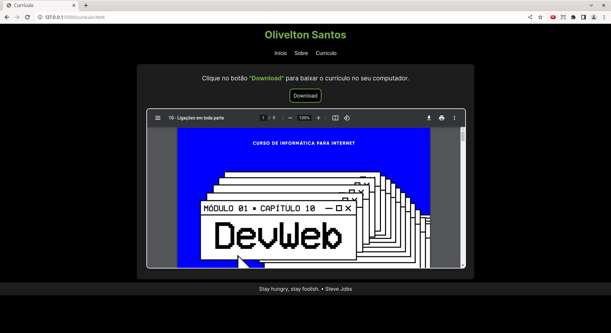
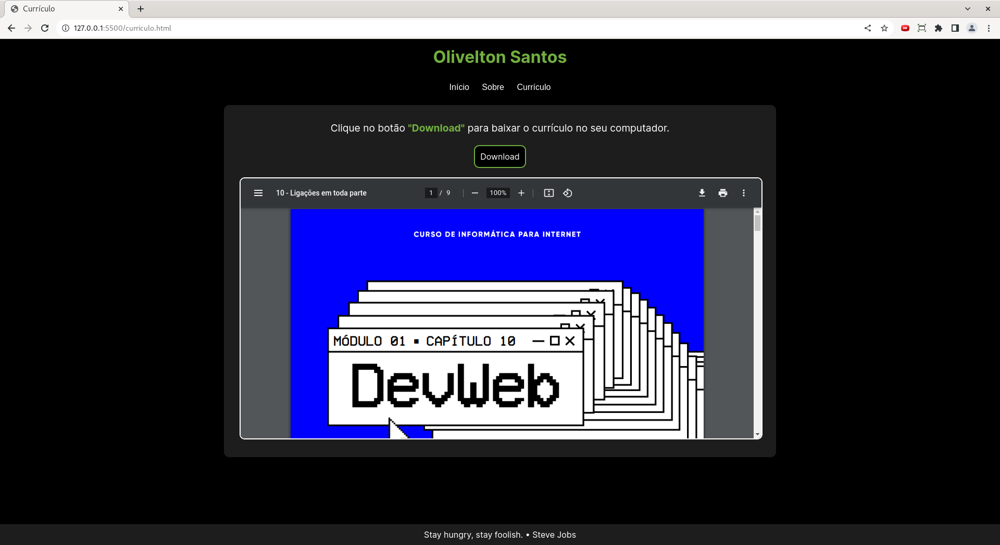

### 💡 Ideia do projeto:

O ponto de partida foi quando li um [post](https://www.instagram.com/p/CoLfxKUOxtx/) criado pela [Raquel Maia](https://github.com/raquel-maia) no Instagram dela, o desafio foi criar um portfólio para mostrar projetos e deixar nossos contatos disponíveis.

##

### 🛠 Tecnologias utilizadas:

- HTML5
- CSS3

##

### 🎨 Design 

Visual

Decidi optar por um visual minimalista, o foco principal está no conteúdo, portanto para mim faz sentido buscar eliminar as distrações visuais que não sejam relevantes para o meu objetivo principal que é a informação.

Cores

Utilizei uma paleta com 4 cores, sendo 3 cores mais neutras e uma para destaque de elementos como textos, botões, links, etc.

Cores utilizadas:

- cor-primaria: #000000; (preto)
- cor-secundaria: #1d1d1d; (cinza)
- cor-terciaria: #ffffff; (branco)
- cor-quartenaria: #71ae3f; (verde)

Fonte

A fonte utilizada chama-se <a href="https://fonts.google.com/specimen/Inter" target="_blank" rel="external">Inter</a>, conheci essa fonte através de uma distribuição linux chamada <a href="https://elementary.io/" target="_blank" rel="external">Elementary OS</a>. Pessoalmente acho a fonte bem simples, tem boa legibilidade e diferentes pesos (todas essas características se conectam com o meu site).

##

### 📝 Coisas novas que aprendi:

Flex-box

Aprendi um pouco sobre flex-box observando o <a href="https://github.com/raquel-maia/portfolio" target="_blank" rel="external">código CSS da Raquel Maia</a> e testando em algumas partes específicas do meu código, além disso, li algumas explicações neste site chamado <a href="https://www.w3schools.com/css/css3_flexbox.asp" target="_blank" rel="external">W3Schools</a>.

Menu fixo

Uma ideia que tive foi de implementar um menu fixo no site, dessa maneira evita-se que usuário tenha que rolar a página até o topo para acessar o menu. Para saber mais leia o texto clicando <a href="https://www.w3schools.com/howto/howto_css_sticky_element.asp" target="_blank" rel="external">aqui</a>.

Inserir PDF no HTML

Também quis colocar o meu currículo no site, dessa maneira o usuário pode visualizar o PDF sem sair do site ou então basta dar um clique no botão “Download”. Confira um texto explicando como fazer <a href="https://pdf.wondershare.com.br/pdf-knowledge/insert-pdf-in-html.html" target="_blank" rel="external">aqui</a>.

Rodapé fixo

Quando fui criar a página "Currículo" tive um problema com o rodapé, ele não ficava posicionado na parte inferior mas sim próximo a caixa onde está inserido o currículo. Veja abaixo o antes e depois.

**Antes:**

**Depois:**

Para conseguir este resultado você pode ler este texto <a href="https://www.w3schools.com/howto/howto_css_fixed_footer.asp" target="_blank" rel="external">aqui</a> ou olhar o meu código.

##

### 💻 Resultado:

Acesse o site pronto neste link [aqui](https://oliveltonsantos.github.io/portfolio/)!

##

### 💬 Sugestões:

Fico aberto a sugestões de melhoria e ideias, caso você tenha alguma basta me enviar uma mensagem no [Instagram](https://www.instagram.com/navegandoemc0d1gos) ou [LinkedIn](https://www.linkedin.com/in/olivelton-santos).

##

### 📱 Acompanhe a minha jornada:

[GitHub](https://github.com/oliveltonsantos) | [LinkedIn](https://www.linkedin.com/in/olivelton-santos) | [Instagram](https://www.instagram.com/navegandoemc0d1gos) | [YouTube](https://www.youtube.com/@navegandoemc0d1gos)

